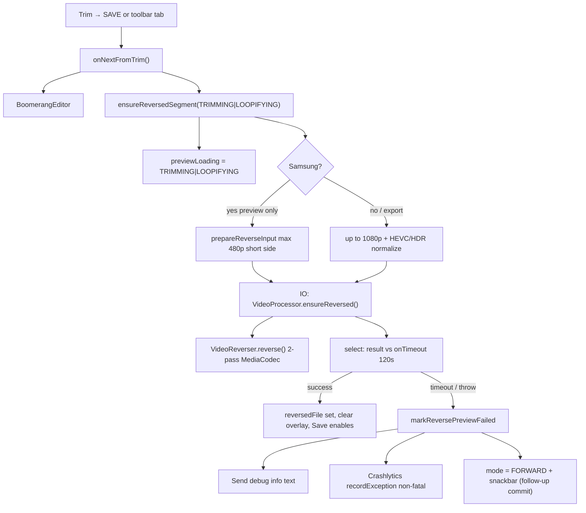

# Engineering handoff — “Trimming..” / preview reverse failures

**Last updated:** June 2026  
**Audience:** Next engineer, agent, or release owner picking up this work  
**Shorter postmortem:** [`trimming-loop.md`](../../../trimming-loop.md) (repo root)  
**Crashlytics ops:** [`docs/diagnostics/firebase-crashlytics-trimming.md`](../../diagnostics/firebase-crashlytics-trimming.md)

---

## Executive summary

Users reported the editor stuck on **“Trimming..”** (full-screen overlay) after leaving Trim, with **Save disabled**. On **Samsung S24+** (e.g. Brazil testers) the overlay sometimes never cleared and **never showed “Couldn’t loop that clip”** even after many minutes.

**“Trimming..” is not a trim operation.** It means the app is building a **reversed MP4** for the default boomerang mode (`FORWARD_THEN_REVERSE`) using a **two-pass `MediaCodec` pipeline** in `VideoReverser`.

We fixed this in layers:

1. **PR #50 (1.0.3)** — codec loop wedges, buffer lifecycle, encoder ranking, first 120s timeout (often **did not unblock UI**).
2. **PR #51 (1.0.5, merged to `main`)** — non-blocking timeout, HEVC/HDR pre-normalize, Media3 decoder fallback, **Send debug info**, Firebase Crashlytics non-fatals.
3. **Follow-up on `feature/firebase-analytics` (commit `f0e706f`, not necessarily on `main` yet)** — Samsung **480p preview** reverse cap, **automatic Forward fallback** + snackbar so users can still preview/save when ping-pong reverse fails.

**Confirmed production signal (developer device, 1.0.5):** Samsung **SM-S926B**, **720p H.264**, ~5.3 s trim → **120 s timeout** (Crashlytics non-fatal + share sheet). So the issue is **not only HEVC/HDR**.

---

## User-visible behavior (what to call the bug)

| UI copy | `EditorLoadingKind` | Meaning |
|---------|---------------------|---------|
| **Trimming..** | `TRIMMING` | First entry Trim → editor; reverse generation started |
| **Loopifying..** | `LOOPIFYING` | Later reverse (mode change, return from Trim) |
| **Couldn’t loop that clip** | `reverseFailed` (older builds) or Forward fallback (newer) | Reverse failed or timed out |
| **Send debug info** | — | Plain-text diagnostic share (PR #51) |

**Save is disabled** while:

- `previewLoading` is set (overlay visible), or
- Mode needs reverse but `reversedFile == null` and failure not yet surfaced (`awaitingReverse` / `reverseUnavailable` in `BoomerangEditorScreen.kt`).

---

## Architecture (read this first)



### Key files

| File | Responsibility |
|------|----------------|
| `ui/OpenLoopViewModel.kt` | `ensureReversedSegment`, 120s `select`+`onTimeout`, failure + Crashlytics, Forward fallback |
| `ui/BoomerangEditorScreen.kt` | Overlay, ExoPlayer playlist, Save gate, Send debug info UI |
| `ui/OpenLoopUiState.kt` | `EditorTabState` — `previewLoading`, `reversedFile`, `reverseFailed`, `reverseSupportReport` |
| `media/VideoProcessor.kt` | `prepareReverseInput`, `scaleSourceForReverse`, Transformer **decoder fallback** |
| `media/VideoReverser.kt` | Two-pass reverse, pass-1 frame cap (30 fps), encoder preference (Exynos/SEC/QTI) |
| `media/MediaFormatUtils.kt` | `sourceNeedsReverseNormalize` — HEVC or HDR → Media3 before reverse |
| `media/DeviceMediaHints.kt` | `SAMSUNG_PREVIEW_REVERSE_MAX_SHORT_SIDE = 480`, `isSamsungDevice()` |
| `diagnostics/ReverseCrashlytics.kt` | `recordException` + custom keys for non-fatals |
| `diagnostics/ReverseDiagnostics.kt` | Share-sheet text + probe for mime/size/fps |

**Export/save** uses `renderBoomerang()` → separate `ensureReversed` / reverse inside worker — **full quality** (1080p cap), not the Samsung 480p preview cap.

---

## Root causes (stacked — all were real)

### 1. Preview reverse is inherently heavy

- **Pass 1:** Re-encode trim window with **every frame a keyframe** (`KEY_I_FRAME_INTERVAL = 0`) so pass 2 can seek frame-by-frame backwards.
- Library imports and phone exports: **HEVC, HDR, 60 fps metadata**, bad sync points → slow or fragile path.
- Symptom: **Trimming..** for 30–120+ seconds on slow encoders (e.g. `c2.google.avc.encoder`).

See [`RESEARCH-reverse-video.md`](../boomerang-rollout/RESEARCH-reverse-video.md), [lesson 020](../../lessons_learned/020-imported-clips-hdr-codec-and-reverse-failure-recovery.md).

### 2. `withTimeoutOrNull` did not unblock the UI (critical for “infinite Trimming”)

Kotlin coroutine cancellation is **cooperative**. If `MediaCodec` blocks in native code, the timeout coroutine may **never return**:

- `reverseFailed` never set → no **“Couldn’t loop that clip”**
- Overlay stays forever

This matched testers waiting **much longer than 2 minutes** with no failure screen.

**Fix (PR #51):** Use `select { worker.onAwait; onTimeout(120_000) }`, return immediately on deadline, call `markReversePreviewFailed`, **do not** wait for cancelled worker (avoid `coroutineScope` that waits on children).

References:

- [Kotlin `withTimeout`](https://kotlinlang.org/api/kotlinx.coroutines/kotlinx-coroutines-core/kotlinx.coroutines/with-timeout.html)
- [Android coroutines best practices](https://developer.android.com/kotlin/coroutines/coroutines-best-practices)

### 3. Samsung / OEM codecs (HEVC/HDR and decoder fallback)

- CameraX **HD** does not force H.264; Samsung often records **HEVC and/or HDR** at ≤1080p.
- Old logic only pre-scaled when **short side > 1080p**, so 720p HEVC went straight into `VideoReverser`.
- Media3 `Transformer` default **does not enable decoder fallback** ([androidx/media#2189](https://github.com/androidx/media/issues/2189), [#2751](https://github.com/androidx/media/issues/2751)).

**Fix (PR #51):**

- `sourceNeedsReverseNormalize()` — HEVC or HDR → `scaleSourceForReverse` via Transformer before reverse.
- `DefaultDecoderFactory.setEnableDecoderFallback(true)` on Transformer.
- `VideoReverser.selectAvcEncoder` — prefer Exynos/SEC/QTI over `c2.google.avc.encoder`.

### 4. Pass-1 import wedge (PR #50)

| Issue | Effect |
|--------|--------|
| Seek before trim start → zero frames | EOS / hung loop |
| Frame skip without draining decoder buffers | `CodecException` |
| Restarting active `reverseJob` | Lost progress |
| Stale `previewLoading` with no job | TRIMMING forever |

Fixed in `VideoReverser` pass-1 loop and `OpenLoopViewModel` session/generation tokens.

### 5. Product gap after timeout (1.0.5 on Play)

Even with failure UI, **Save stayed disabled** when `reverseFailed && reversedFile == null`. Users on Samsung could not use the app except by manually picking **Forward** in the Loop tab.

**Fix (follow-up `f0e706f` on `feature/firebase-analytics`):**

- `markReversePreviewFailed` → set `mode = FORWARD`, clear `reverseFailed`, keep `reverseSupportReport` for share.
- Snackbar via `BoomerangEvent.ReversePreviewFallbackForward`.
- `retryReverseSegment()` restores ping-pong mode and re-runs reverse.

### 6. Samsung 720p AVC still > 120s (production evidence)

Crashlytics + share sheet on **SM-S926B**, **video/avc**, **1280×720**, **5.3 s trim**, `hevc_or_hdr_normalize=false` → timeout, not HEVC-only issue.

**Fix (follow-up):** On Samsung, preview `ensureReversed` passes `maxReverseShortSide = 480` so pass 1/2 runs on a smaller surface. **Export unchanged.**

---

## Release / PR timeline

| Item | Version | What shipped |
|------|---------|----------------|
| [PR #50](https://github.com/stozo04/OpenLoop/pull/50) | 1.0.3 (`versionCode` 4) | Pass-1 seek fix, 30 fps pass-1 cap, MediaCodec buffers, encoder ranking, `withTimeoutOrNull` 120s |
| [PR #51](https://github.com/stozo04/OpenLoop/pull/51) | 1.0.5 (`versionCode` 5) | `select`+`onTimeout`, HEVC/HDR normalize, decoder fallback, Send debug info, Crashlytics |
| `feature/firebase-analytics` @ `f0e706f` | TBD | Samsung 480p preview + Forward fallback + snackbar (merge to `main` when ready) |

---

## Code reference — PR #51 timeout (production path)

```kotlin
// OpenLoopViewModel.ensureReversedSegment — simplified
val worker = async(Dispatchers.IO) {
    runCatching {
        videoProcessor.ensureReversed(..., maxReverseShortSide = previewReverseCap)
    }
}
val outcome = select {
    worker.onAwait { it }
    onTimeout(REVERSE_PREVIEW_TIMEOUT_MS) {  // 120_000L
        worker.cancel()
        Result.failure(PreviewReverseTimeoutException())
    }
}
```

On failure → `markReversePreviewFailed` → `ReverseCrashlytics.reportPreviewFailure` + UI state.

**Constant:** `OpenLoopViewModel.REVERSE_PREVIEW_TIMEOUT_MS = 120_000L`

---

## Remote diagnostics (no logcat from testers)

### A. In-app “Send debug info” (immediate)

After failure UI (~120s on 1.0.5+). Plain text: device, version, mime, resolution, trim window, outcome.

Built by `ReverseDiagnostics.buildReverseSupportReport` / `ReverseCrashlytics.supportReportForShare`.

### B. Firebase Crashlytics (aggregate)

- Project: **openloop-8c266**
- Package: `io.github.stozo04.openloop`
- **Non-fatals** — e.g. `PreviewReverseTimeoutException`
- **Keys:** `reverse_outcome`, `video_mime`, `video_width`, `hevc_or_hdr_normalize`, `app_version`, …
- Upload: **next app launch** after failure (not instant)

Direct link pattern:  
`https://console.firebase.google.com/project/openloop-8c266/crashlytics`

Requires `app/google-services.json` at build time (gitignored). See `app/google-services.json.README`.

### C. System bug report (heavy)

Developer options → Take bug report. For old builds or deep native codec traces.

**Do not** ask non-technical testers to install Logcat Reader apps.

---

## Play Console / policy notes

- **Advertising ID declaration:** `firebase-analytics` adds `AD_ID` permission. Declare in Play Console (Analytics, not ads). **Contains ads** stays **No**.
- **Data safety:** Store listing still says “no analytics” in places — update when Crashlytics + Analytics ship to production. See `docs/play-store/data-safety.md`.
- **Privacy policy:** Claims no crash reporting — update before wide Crashlytics rollout.

---

## Testing

### Unit tests (no real MediaCodec)

```bash
./gradlew :app:testDebugUnitTest --tests "io.github.stozo04.openloop.ui.OpenLoopViewModelTest.reverse*"
```

Important tests:

- `reverse preview times out when ensureReversed never completes` — expects **FORWARD** fallback, not `reverseFailed`
- `retrying reverse after a failure clears the flag and succeeds`
- `ensureReversedSegment does not restart reverse while a job is already in flight`

**Test hooks:** `OpenLoopViewModel.reversePreviewTimeoutDisabledForTests` (avoids virtual-time deadlock with `advanceUntilIdle`). Do not enable in production.

**IO in tests:** `ensureReversed` runs on `Dispatchers.IO`; use `awaitEditorReverseReady()` helper in `OpenLoopViewModelTest` (poll + short `Thread.sleep`), not only `advanceUntilIdle()`.

### On-device (mandatory)

Unit tests use `FakeVideoProcessor` — they **do not** exercise `VideoReverser`.

1. Camera + gallery import on **Samsung** (and one non-Samsung control).
2. Trim → editor → note **Trimming..** (up to ~2 min acceptable on 1.0.5).
3. **Success:** Preview loops, Save enables.
4. **Failure:** Within ~120s, failure UI or Forward fallback + snackbar (follow-up build); **Send debug info** works.
5. Force-stop → reopen app → Crashlytics non-fatal (if Firebase configured).

### Lint (PR gate)

```bash
./gradlew :app:lintDebug
```

---

## Regression checklist (copy for QA)

| Step | Expected (1.0.5+) | Expected (with `f0e706f`) |
|------|---------------------|---------------------------|
| Enter editor after Trim | Trimming.. up to ~120s max | Same; Samsung may finish faster (480p) |
| Reverse succeeds | Overlay clears, Save enables | Same |
| Reverse times out | Failure UI + Send debug info | Forward preview + snackbar; Save enables |
| Retry ping-pong | Try again / Loop direction | `retryReverseSegment` → FORWARD_THEN_REVERSE |
| Crashlytics | Non-fatal after reopen app | Same |

---

## Open work / next steps

| Priority | Task |
|----------|------|
| P0 | Merge `feature/firebase-analytics` (or cherry-pick `f0e706f`) to `main`, bump version, ship to Play |
| P0 | Update **Data safety** + privacy policy for Crashlytics/Analytics |
| P1 | Validate **480p preview** on SM-S926B — does ping-pong complete under 120s? |
| P1 | If still slow: stronger fallback (forward preview while export reverse runs in background) |
| P2 | Issue #41 — progress % during reverse, further frame thinning for pass 1 |
| P2 | Upload R8 **mapping.txt** to Firebase for readable stacks |

---

## Real-world Crashlytics example (template)

Use this to recognize the same issue in console:

| Key | Example value |
|-----|----------------|
| `reverse_outcome` | `Timed out after 120s` |
| `video_mime` | `video/avc` |
| `video_width` / `video_height` | `1280` / `720` |
| `hevc_or_hdr_normalize` | `false` |
| `trim_window_ms` | `5300` |
| Device | Samsung SM-S926B |

Stack top: `PreviewReverseTimeoutException` in `ensureReversedSegment` — that is the **deadline**, not the native wedge (wedge stays on IO thread).

---

## Related documentation

| Doc | Purpose |
|-----|---------|
| [`trimming-loop.md`](../../../trimming-loop.md) | Short postmortem + links |
| [`firebase-crashlytics-trimming.md`](../../diagnostics/firebase-crashlytics-trimming.md) | Firebase setup + console |
| [`HANDOFF.md`](./HANDOFF.md) | Earlier investigation notes (June 2026, pre-1.0.5); superseded by this file for current state |
| [Lesson 020](../../lessons_learned/020-imported-clips-hdr-codec-and-reverse-failure-recovery.md) | HDR / failure flag |
| [Lesson 021](../../lessons_learned/021-reverse-downscale-surface-mismatch.md) | Scale in Media3 only |
| [Issue #41 kickoff](../../prompts/issue-41-loopifying-optimization-kickoff.md) | Performance track |

---

## Agent / session context

- Brazilian **S24+** testers: infinite Trimming on older builds; 1.0.5 surfaces timeout + diagnostics.
- Developer repro on **SM-S926B** with **720p AVC** confirmed timeout path works in Crashlytics.
- Stash `stash@{0}` on `main` was applied to `feature/firebase-analytics` (Samsung + analytics branch merge); may drop after merge: `git stash drop stash@{0}`.

---

## One-sentence summary

**Trimming..** is preview reverse; Samsung and imports stress MediaCodec; **`withTimeoutOrNull` could block the UI forever**; we fixed with a **hard 120s deadline**, **codec/normalize improvements**, **remote diagnostics**, and (follow-up) **480p Samsung preview + Forward fallback** so users are never blocked from saving.
