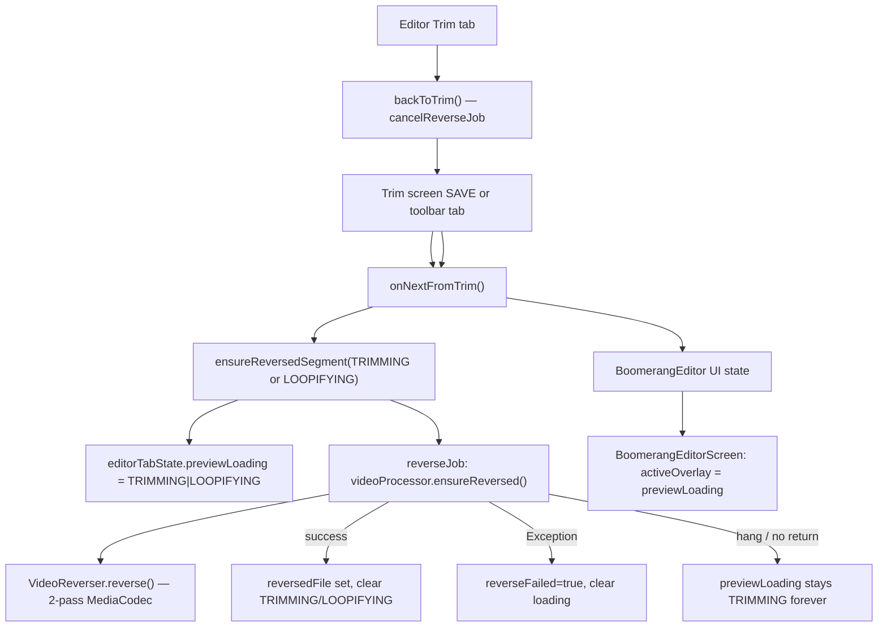

# HANDOFF — Editor stuck on "Trimming.." (library import)

**Status:** Fixed (June 2026) — library import reverse completes; see commit on `feature/UI-Updates`.  
**Branch context:** Work was on `feature/UI-Updates` (confirm current branch before continuing).  
**Prior agent transcript:** [editor-trimming investigation](57f6c176-6143-4ce9-87aa-3e3c7410f7c5) (Cursor agent transcript UUID).

---

## Symptom

On the **tabbed boomerang editor**, the preview shows the full-screen loading overlay with copy **"Trimming.."** and never clears. User can reproduce with:

1. **Import a video from the device library** (not a clip captured in OpenLoop).
2. Go through **Trim → editor** (SAVE or bottom-bar Speed / Loop / Filter).
3. **Do not change trim handles**; switch between editor tabs (Speed / Loop / Filter, sometimes Trim round-trip).

Save stays disabled while the overlay is up. User perceives this as tied to tab switching; root cause may be **reverse generation never finishing** or **UI state never clearing** (not necessarily `switchTab` itself — `switchTab` has no side effects).

---

## User-provided Logcat

| File | Notes |
|------|--------|
| `Google-Pixel-10-Pro-Fold-Android-16_2026-06-02_095126.logcat` | First report |
| `Google-Pixel-10-Pro-Fold-Android-16_2026-06-02_095908.logcat` | Still stuck after ViewModel + `VideoReverser` fixes |

**Logcat parsing (095908):** ~299 lines from `io.github.stozo04.openloop`. One app `ERROR`: `GraphicsTracker: Tried to deallocate non dequeued buffer` during codec work. `VideoReverser: selectAvcEncoder: c2.google.avc.encoder for 368x832` (portrait import). Heavy `MPEG4Writer` / `AidlBufferPool` activity (hundreds of buffer alloc/recycle lines) — reverse pass 1 was **actively encoding**, not idle. **No** `reverse pass2:` log line and **no** `OpenLoopViewModel: Reverse generation for preview failed` in the captured window — either log ended mid-pass-1, or pass 2 never started, or pass 1 hung later.

---

## How "Trimming.." is driven (read this first)



| Layer | Responsibility |
|-------|----------------|
| `EditorLoadingKind.TRIMMING` | Copy **"Trimming.."** — used on **first** `onNextFromTrim` for a clip session |
| `EditorLoadingKind.LOOPIFYING` | **"Loopifying.."** — later reverse kicks (mode change, return from trim) |
| `EditorTabState.previewLoading` | ViewModel flag; editor overlay reads this (via `effectivePreviewLoading` guard) |
| `EditorTabState.reversedFile` | Cached reversed MP4; when non-null, preview playlist can loop boomerang |
| `EditorTabState.reverseFailed` | Should show retry UI (`reverse_failed` testTag), not infinite shimmer |
| `VideoProcessor.ensureReversed()` | `prepareReverseInput` → optional scale → `VideoReverser.reverse()` |

**UI overlay** (`BoomerangEditorScreen.kt`):

- `activeOverlay = sessionOverlayLoading ?: effectivePreviewLoading`
- `effectivePreviewLoading` hides TRIMMING/LOOPIFYING if `reversedFile != null` (stale-state guard)
- Save disabled when `activeOverlay != null` or `awaitingReverse` or `reverseUnavailable`

---

## Fixes already landed (still insufficient on device)

### 1. ViewModel session / loading hygiene (`OpenLoopViewModel.kt`)

- `editorSessionActive` — first `onNextFromTrim` resets tab state; return from `backToTrim` **preserves** session (no full reset).
- `resetEditorTabForNewClip()` on **capture finalize** and **`onVideoPicked` success** — clears tab state + `editorSessionActive`.
- `reverseGeneration` token — stale reverse job completions ignored after cancel/supersede.
- `ensureReversedSegment` — no early-return on TRIMMING while dead; recovers stale loading if `previewLoading` set but `reverseJob` not active; always clears TRIMMING/LOOPIFYING on success/failure/cancel paths.
- `updateTrim` — no-op when handles unchanged; still invalidates reverse when trim actually changes in editor.
- `updateMode(FORWARD)` — `cancelReverseJob()`.
- Removed editor **back arrow**; Trim toolbar → `backToTrim`, Delete → `discardTrim`.

**Tests added (unit):** `returning from trim via toolbar preserves editor session and cached reverse`, `updateTrim with unchanged handles is a no-op in the editor`, `importing a library clip resets editor tab state for a fresh session`.

### 2. VideoReverser pass-1 loop (`VideoReverser.kt`)

Library trims often use `SEEK_TO_PREVIOUS_SYNC` **before** trim start. Old code treated `sampleUs !in 0..endUs` as immediate EOS → **zero frames** → with `durationUs > 0` from container metadata, `runDecodeEncodeLoop` could spin without setting `decoderDone` (documented wedge for imports).

**Changes:**

- After seek, **advance** samples until `sampleUs >= startUs`.
- End samples when `sampleUs > endUs` (not `!in 0..endUs`).
- If `inputDone && !muxerStarted`, set `decoderDone` (zero-frame exit).

**Not verified on user's device yet** — log shows encoding progressed (many frames), so this fix may address a subset of imports only.

---

## Highest-priority hypotheses for next engineer

### A. Reverse still running (looks like "stuck" but is slow)

Pass 1 re-encodes **every frame in the trim window as an I-frame** (`KEY_I_FRAME_INTERVAL = 0`). Imported clips can report **very high frame rates** (log showed ~64 fps metadata on a 368×832 source). A 30 s window → thousands of frames → minutes on device, overlay stays **Trimming..** the whole time.

**Next steps:**

- Log **progress** from `ensureReversed` / `VideoReverser` at INFO (pass 1 %, pass 2 frame count).
- On device, wait 3–5 min once and see if overlay clears or `reverse_failed` appears.
- Consider **Issue #41** scope (`docs/prompts/issue-41-loopifying-optimization-kickoff.md`) — progress UI, frame-rate clamp for reverse-only path, or faster reverse strategy.

### B. Reverse hang inside MediaCodec (no Exception, no completion)

Log ends with active `MPEG4Writer` / `PipelineWatcher: frameIndex not found` — possible encoder pipeline wedge on Pixel 10 Pro Fold + library codec.

**Next steps:**

- Reproduce with **screen kept on**; capture log until `reverse pass2:` or `Reverse generation for preview failed`.
- Add **timeout** in `ensureReversedSegment` (e.g. 120s) → set `reverseFailed`, clear loading, log timeout.
- Try same file after **pre-scale** path (if short side > 1080) — different Transformer + reverse input.

### C. `previewLoading` stuck while job dead (state bug)

Partially addressed; user still sees issue → reproduction may not hit fixed paths.

**Next steps:**

- Add temporary debug overlay or log line: `previewLoading`, `reverseJob.isActive`, `reversedFile`, `reverseFailed`, `reverseGeneration`.
- Inspect whether **`onNextFromTrim` is called repeatedly** (Trim ↔ editor toolbar) restarting reverse while user thinks they only switched Speed/Loop/Filter **inside** editor.
- Compose **androidTest** with fake `VideoProcessor` that never completes + assert timeout/recovery (once timeout exists).

### D. Failure swallowed or not mapped to `reverseFailed`

Lesson 020 fixed **Loopifying..** forever on HDR; **Trimming..** uses the same `previewLoading` / `reverseFailed` machinery.

**Next steps:**

- Grep log for `Reverse generation for preview failed`.
- Force failure: import undecodable clip → must show `reverse_failed` UI, not Trimming.

---

## Key files

| File | Why |
|------|-----|
| `app/src/main/java/io/github/stozo04/openloop/ui/OpenLoopViewModel.kt` | `ensureReversedSegment`, `onNextFromTrim`, `backToTrim`, `updateTrim`, `cancelReverseJob`, `resetEditorTabForNewClip` |
| `app/src/main/java/io/github/stozo04/openloop/ui/BoomerangEditorScreen.kt` | Overlay, `awaitingReverse`, save gate, ExoPlayer + filter seam notes for HDR |
| `app/src/main/java/io/github/stozo04/openloop/ui/OpenLoopUiState.kt` | `EditorTabState`, `EditorLoadingKind` |
| `app/src/main/java/io/github/stozo04/openloop/media/VideoProcessor.kt` | `ensureReversed`, `prepareReverseInput`, `scaleSourceForReverse` |
| `app/src/main/java/io/github/stozo04/openloop/media/VideoReverser.kt` | Two-pass reverse, pass-1 loop fix |
| `app/src/main/java/io/github/stozo04/openloop/ui/TrimScreen.kt` | Toolbar tabs call `onNextFromTrim(tab)` |
| `app/src/test/java/io/github/stozo04/openloop/ui/OpenLoopViewModelTest.kt` | Regression tests (fake processor — does not exercise real MediaCodec) |

---

## Reproduction checklist (on device)

1. Fresh install or clear app data.
2. Gallery → import **same library video** user used (portrait H.264 ~368×832 per log; ask if HDR/HEVC).
3. Trim → **SAVE** (or tap **Speed** on trim toolbar — also calls `onNextFromTrim`).
4. Note overlay text: **Trimming..** vs **Loopifying..** (indicates fresh vs return session).
5. Switch Speed / Loop / Filter **without** touching filmstrip.
6. Optional: Tap **Trim** in editor bottom bar → back to trim screen → tap **Loop** → re-enter editor (preserves session; may restart reverse if cache cleared).
7. Wait **at least 3 minutes** once to separate hang vs slow.
8. Capture Logcat filtered: `package:io.github.stozo04.openloop` + tags `OpenLoopViewModel`, `VideoReverser`.

**Expected if healthy:** Overlay clears, preview loops, Save enables.  
**If reverse fails:** `reverse_failed` overlay + Try again (`retryReverseSegment`).  
**Bug:** **Trimming..** indefinitely, Save disabled, no `reverse_failed`.

---

## Suggested implementation order

1. **Instrumentation** — progress + state dump on overlay show/hide (low risk, unblocks diagnosis).
2. **Timeout → `reverseFailed`** — never infinite Trimming (product fix even if root is slow codec).
3. **Reproduce on Pixel 10 Pro Fold** with user's file; confirm pass-1 completion vs hang (watch for `reverse pass2:` log).
4. **Performance** — clamp/sparsify frames for reverse pass 1 on import (larger change; see issue-41).
5. **Lesson doc** — if new root cause confirmed, add `docs/lessons_learned/023-….md` (pattern from [[020-imported-clips-hdr-codec-and-reverse-failure-recovery]]).

---

## Tests to run before PR

```bash
./gradlew :app:testDebugUnitTest --tests "io.github.stozo04.openloop.ui.OpenLoopViewModelTest"
./gradlew :app:compileDebugAndroidTestKotlin
# Real reverse: instrumented (slow) — VideoReverserTest, VideoProcessorPreScaleTest on device/emulator
```

Unit tests **do not** run real `VideoReverser`; on-device validation is mandatory for this bug.

---

## Related docs

- `docs/lessons_learned/020-imported-clips-hdr-codec-and-reverse-failure-recovery.md` — HDR / failure flag / Loopifying wedge (same family).
- `docs/lessons_learned/019-reverse-rotation-strip-decoder-restamp-muxer.md` — rotation on imports.
- `docs/lessons_learned/021-reverse-downscale-surface-mismatch.md` — scale only in Media3 path, not inside reverser.
- `docs/active/boomerang-rollout/07-import-from-library.md` — import → Trim flow.
- `docs/prompts/issue-41-loopifying-optimization-kickoff.md` — optimization track.
- `docs/active/boomerang-rollout/RESEARCH-reverse-video.md` — reverse algorithm rationale.

---

## Open questions for the user (when back in context)

1. Exact repro path: **only in-editor tabs**, or **Trim tab round-trip** too?
2. Overlay always **Trimming..** or sometimes **Loopifying..**?
3. How long waited before calling it stuck?
4. Does **Try again** / `reverse_failed` ever appear?
5. Sample video: codec (H.264/HEVC), HDR?, duration, resolution.

---

## Definition of done (this bug)

- [ ] Library import → editor: overlay clears within a **bounded** time OR shows **retry** with clear failure (no infinite **Trimming..**).
- [ ] Tab switching (and Trim round-trip) does not leave stale `previewLoading` with no active `reverseJob`.
- [ ] On-device proof on imported clip (same class as user's Pixel 10 Pro Fold repro).
- [ ] Unit and/or instrumented test for timeout or stale-loading recovery (if implemented).
