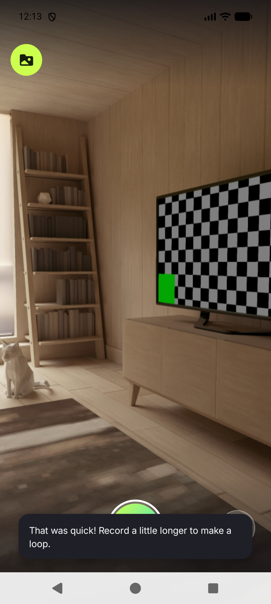
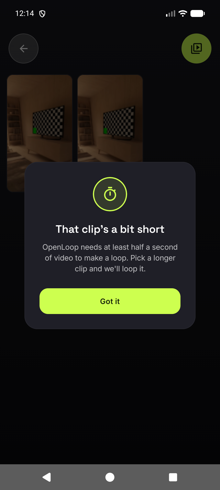

# Issue #95 — short-clip crash fix + "clip too short" messaging (verification)

**Date:** 2026-08-08 · **Device:** Pixel_8 AVD, API 37, 1080×2400 · **Build:** debug, versionCode 33 / 1.0.33
**Branch:** `claude/github-issue-95-fix-xv25e3` (merged with `main` @ 22a73a7)

Re-verification after merging 5 weeks of `main` into the PR branch. Supersedes the July 6 reports,
which verified code that no longer exists.

## Gate results

| Check | Result |
|---|---|
| `:app:assembleDebug` + `:app:assembleRelease` | `BUILD SUCCESSFUL`, exit 0, zero `e:` lines |
| `:app:testDebugUnitTest` | **284 tests, 0 failures, 0 errors, 0 skipped** |
| `:app:connectedDebugAndroidTest` (Pixel_8 AVD) | **88 tests, 0 failures, 0 errors, 1 skipped** — the skip is `VideoReverserTest.reverse_pass1SurvivesOnSamsung_…`, which self-skips off Samsung hardware |
| `:app:lintDebug` (Engine 1) | exit 0, **0 errors**, 26 warnings — all pre-existing on `main` (dependency-version + `InlinedApi` on `POST_NOTIFICATIONS`); none in the changed code |
| Tier 3 markdown checks (CI) | pass |
| IDE "Inspect Code" (Engine 2) | **attempted, result rejected as vacuous** — see below. Must be run from the IDE by the owner. |

New tests confirmed present in the run's XML results:

- `TrimHandleMathTest` — 3 tests (335 ms pin sweep, normal-clip clamp, exhaustive duration/target sweep)
- `OpenLoopViewModelTest` — `finalize below the minimum loop length …`, `finalize with ERROR_NO_VALID_DATA …`,
  `onVideoPicked under the minimum loop length …`, `onVideoPicked when post-copy duration is under the minimum …`,
  `onVideoPicked exactly at the minimum loop length is accepted`

## Live device runs

Test clip built with ffmpeg at the exact Crashlytics duration:
`-vf fps=30 -frames:v 10` → **333 ms** container duration, pushed to `/sdcard/Movies/` and media-scanned.

### 1. Capture too short → snackbar (`ERROR_NO_VALID_DATA`)

Tap-to-start, tap-to-stop 250 ms later on the viewfinder.

```
D OpenLoopViewModel: Video burst recording started.
E OpenLoopViewModel: Video burst recording failed: 8      ← ERROR_NO_VALID_DATA
```

App stays on the viewfinder and shows the nudge instead of returning silently.



### 2. Import 333 ms clip → friendly dialog, never enters Trim

Gallery → Import a video → pick the 333 ms clip → Done.



"Got it" returns to the Gallery (`Back to camera` / `Import a video` / `Video thumbnail` in the
uiautomator dump — no Trim nodes). Zero `FATAL`, zero `IllegalArgumentException`, zero
`Cannot coerce` in logcat across the whole session.

### 3. Control — a normal clip is unaffected

Imported a 5 s clip → routes to Trim as before (`00:00.0 — 00:05.0`). Dragged the START handle
right and the END handle left → `00:01.4 — 00:04.0`. Normal clamp behavior intact, no crash.

## Not verified

- **Engine 2 (IDE "Inspect Code") — the headless run is currently vacuous; must be run from the IDE.**

  After Studio was closed, `inspect.bat` (STATIC_ANALYSIS.md §Tier 2 command) ran to completion in
  ~10 s and reported **zero problems**, writing only `.descriptions.xml` and no per-inspection
  result files. That is not a pass. Proof: a throwaway `app/src/main/java/.../ZzInspectProbe.kt`
  containing an unused import, a redundant explicit type, a stray semicolon and three misspellings
  was added and the run repeated — **still zero result files.** The probe was deleted afterwards
  (`git status` clean).

  Cause: `inspect.bat` does not run a Gradle sync, and this project stores its module model in
  Studio's external storage (`ExternalStorageConfigurationManager enabled="true"`; no
  `modules.xml`/`.iml` under `.idea/`), so headless Studio loads **0 modules** and no source file
  belongs to a scope. Log tell:
  `PerProjectIndexingQueue - Finished for [OpenLoop]. No files to index with loading content.`
  Observed on Studio Quail 2026.1.1 (`AI-261.23567.138.2611.15503007`). Gotcha added to
  [`docs/STATIC_ANALYSIS.md`](../STATIC_ANALYSIS.md) §Tier 2.

  **Owner action:** run Engine 2 from the IDE — *Analyze → Inspect Code…* with the whole project as
  scope — which uses the synced model. Engine 1 (Android Lint) is clean and the Tier 3 headless
  markdown approximation passed in CI, so the remaining exposure is the Kotlin-redundancy /
  Grazie-proofreading class only.
- **TalkBack** readout of the new copy, and the accessibility `setProgress` call sites, were not
  driven on-device. Both a11y sites route through the same `TrimHandleMath` functions covered by
  the JVM sweep.
- **A sub-400 ms capture with valid data** cannot be produced on the emulator (CameraX finalizes
  `ERROR_NO_VALID_DATA` under ~700 ms there). That branch is covered by the JVM finalize test with
  `durationOf = 335 ms`.
- **The clamp as a live backstop**: with the entry-point gates in place, a too-short clip can no
  longer reach the Trim screen through a normal path, so the inverted-range guard could not be
  exercised through the UI. It is covered by `TrimHandleMathTest`'s exhaustive sweep.
