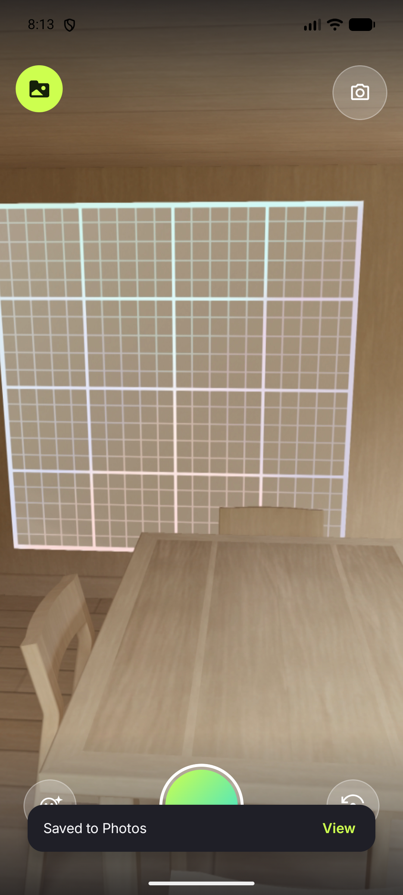

# E2E proof — Play in-app review gate (Issue #121, Step 4)

**Date:** 2026-08-09 · **Device:** `Pixel_8` AVD (`sdk_gphone16k_x86_64`, API 37, `emulator-5556`)
**Build:** debug, from `feature/aso-landing-and-review` · **App version:** 1.0.38 (versionCode 38)

Full run narrative, build/test/lint gates and the manual QA checklist live in **PR #124** — this
file keeps only what the PR description can't: the on-device evidence and the logcat read.

`camera → record ~3 s → Trim → SAVE → editor → Save boomerang → render → share sheet → back →`
**"Saved to Photos" snackbar.** No review card — correct, the counter was at 1 and the gate is 3.



## The counter, read off the device

Only observable in DataStore, so it was read straight out of the app's private storage:

```
$ adb shell run-as io.github.stozo04.openloop \
    cat files/datastore/openloop_preferences.preferences_pb | xxd
00000000: 0a1e 0a18 6861 735f 636f 6d70 6c65 7465  ....has_complete
00000010: 645f 6f6e 626f 6172 6469 6e67 1202 0801  d_onboarding....
00000020: 0a16 0a10 7361 7665 645f 6c6f 6f70 5f63  ....saved_loop_c
00000030: 6f75 6e74 1202 1801                      ount....
```

`saved_loop_count` → `12 02 18 01` — a value message holding varint **1**. One save, one increment,
against the real `preferencesDataStore`.

## Logcat

No `FATAL` and no `ANR` from `io.github.stozo04.openloop`; the pid (5563) was unchanged across the
whole run, so nothing crashed and restarted. The only `Failed to query component store for system
resources: 6` lines are pre-existing emulator noise unrelated to this change. The single SIGABRT in
the log is `com.android.bluetooth` (emulator infrastructure, pid 1126), not the app.

## The card itself is internal-test-track work

It was never rendered and **cannot** be on an emulator: Play only surfaces a card for an account
that installed the app from Play, and a sideloaded debug build gets the silent no-op
`launchInAppReview` swallows. Reaching the gate here would only have proved the no-op doesn't crash.
Verification steps are in the PR's QA checklist —
[Test in-app reviews](https://developer.android.com/guide/playcore/in-app-review/test).
