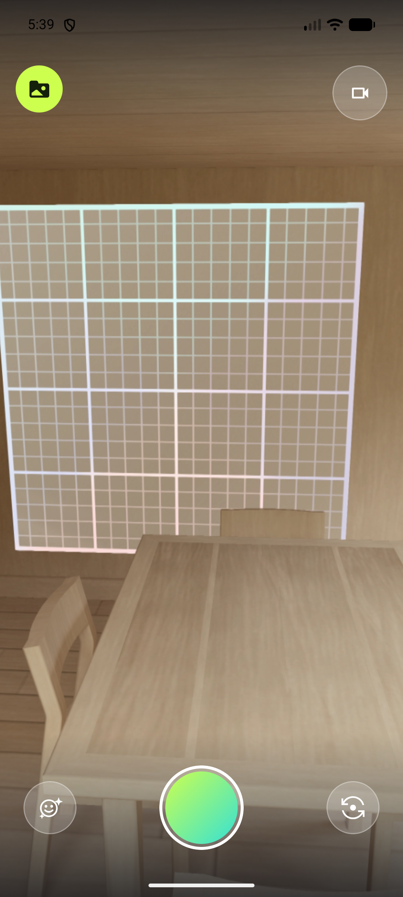
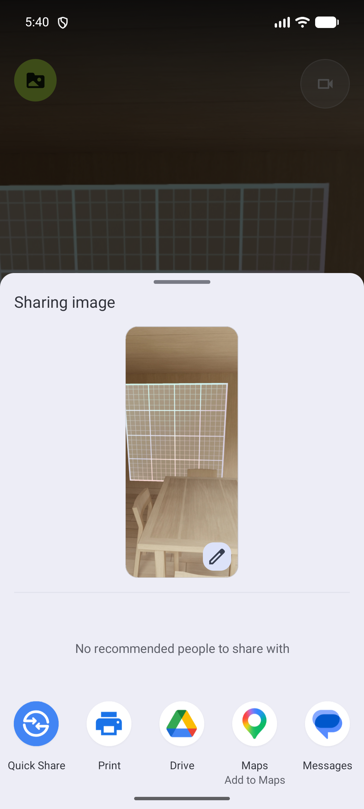
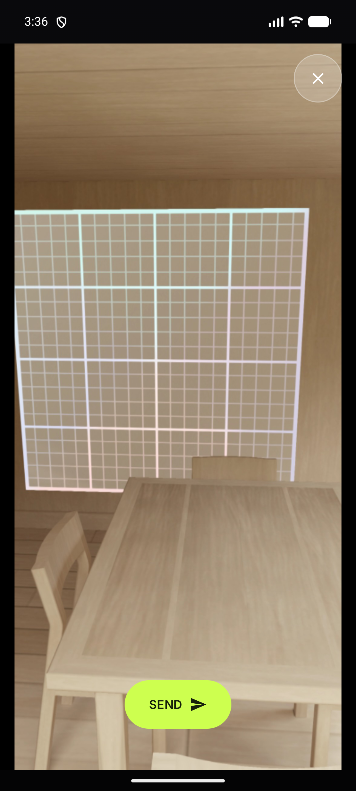

# E2E proof — photo capture mode (2026-08-09)

Feature: `feature/photo-capture` (off `feature/camera-lenses` @ `6dd2419`) · v1.0.37 (versionCode 37)
Spec: [`docs/PRD-photo-capture.md`](../PRD-photo-capture.md)

## Environment

| | |
|---|---|
| Device | Pixel_8 AVD (API 36), booted `-memory 4096` |
| Build | `app-debug.apk`, installed via `adb install -r` |
| Also verified on | Pixel 10 Pro Fold (`58271FDCG000XC`) — owner ran the flow on real hardware throughout development |

The owner's Fold pass drove the one UX change made during the build: the photo shutter originally
rendered a solid-white disc to distinguish it from the record button; that was reverted so the
shutter keeps the lime gradient in **both** modes. Mode is signalled by the top-right toggle icon
and the TalkBack label instead.

## Flow driven

Onboarding → LET'S GO → viewfinder (video mode) → tap top-right toggle → photo mode → tap shutter →
share sheet → back → gallery → tap photo tile → full-screen preview.

## Evidence

| Step | Proof |
|---|---|
| Photo mode active — toggle flipped to the video glyph (shared `CircleIconButton` chrome, 56 dp), lime shutter retained, lens + flip controls still present |  |
| Share sheet after capture — reads **"Sharing image"** with a real thumbnail and image-only targets (Print / Drive), confirming `image/jpeg` replaced the hard-coded `video/mp4` |  |
| Gallery photo preview — full-screen `Image` branch with Close + SEND, never the ExoPlayer overlay |  |

## Both save destinations confirmed

```
--- MediaStore (public Photos) ---
_display_name=OpenLoop_Photo_1786307717273.jpg, relative_path=Pictures/OpenLoop/, mime_type=image/jpeg

--- App library (filesDir/videos) ---
-rw------- 1 u0_a228 u0_a228 201513 2026-08-09 15:35 photo_1786307717273.jpg
```

Matching timestamp id in both, so the public copy and the in-app entry are the same capture.

## Boomerang pipeline skipped

Trim, editor and Processing screens were never entered — the share sheet opened directly from the
shutter tap. Asserted in JVM tests too (`editorState == null`, `renderCount == 0`).

## Logcat

No `FATAL EXCEPTION`, no ANR, no `E/`/`W/OpenLoop` lines across the whole run.

## Verification gate

Re-run in full after the review round below (counts are from the post-review tree):

| Check | Result |
|---|---|
| `:app:compileDebugKotlin` | BUILD SUCCESSFUL |
| `:app:assembleRelease` | BUILD SUCCESSFUL |
| `:app:bundleRelease` | BUILD SUCCESSFUL — signed `app-release.aab` |
| `:app:testDebugUnitTest` | 370 tests, **0 failures** (372 before the review round; 2 deleted) |
| `:app:connectedDebugAndroidTest` | 101 tests, **0 failures**, 1 skipped (pre-existing Samsung-only reverse test) — 103 before; 2 deleted |
| `:app:lintDebug` | **0 errors**; 24 warnings, all pre-existing Gradle/dependency-version + `UseKtx` items in untouched files (same count as before the review round — no new findings) |
| `lintVitalRelease` | "Lint found no errors or warnings" |
| 16 KB alignment (`zipalign -c -P 16 -v 4`) | Verification successful — every `.so` `(OK)`, **not** `(OK - compressed)` (Lesson 011) |

**Not run:** Engine 2 "Inspect Code" (IDE inspections) — unsatisfiable from a git worktree; covered
here by Lint + a zero-new-compile-warning build.

## Review round — ponytail pass (post-review re-verification)

The over-engineering review on PR #120 removed ~88 lines. The only user-visible change is the
capture-mode toggle, which now uses the shared `CircleIconButton` chrome: **56 dp** (was 48 dp),
22 dp icon, matching the lens and flip controls. Re-driven on the same AVD after the change:

- Toggle a11y node measured on-device at `[891,175][1038,322]` = 147 px @ 420 dpi = **56 dp** —
  above the 48 dp minimum interactive target, and larger than what it replaced.
- Tap flips `Switch to photo mode` → `Switch to video mode`, and the shutter label flips to
  `Take photo` — so `CircleIconButton`'s merged semantics still expose description **and** click on
  one node (this was the one real regression risk in the refactor).
- A real capture in photo mode still lands in both destinations after the `publishToPhotos`
  consolidation:
  ```
  MediaStore: OpenLoop_Photo_1786315200589.jpg, Pictures/OpenLoop/, image/jpeg, is_pending=0
  App library: files/videos/photo_1786315200589.jpg  (201265 bytes)
  ```
- Share sheet still reads **"Sharing image"** with a live thumbnail and image-only targets after
  `isPhotoShare` was folded into `shareMimeType`.
- Logcat across the re-run: no `FATAL`, no ANR, no `E/`/`W/OpenLoop`, no `SecurityException`.

## Manual QA left to the owner

- Front camera: capture in photo mode after flipping (D3) — verify the still is not unexpectedly mirrored.
- An active lens baked into a still on real hardware (the emulator's virtual scene has no face, so
  lenses cannot be visually verified there).
- A share target that actually consumes the JPEG end-to-end (Messages/Drive), beyond the chooser preview.
