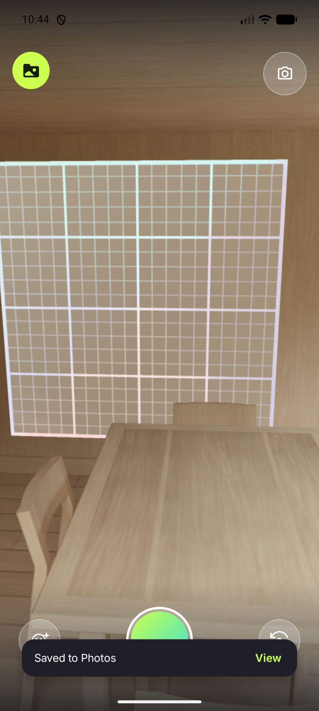

# E2E proof — Play in-app review gate (Issue #121, Step 4)

**Date:** 2026-08-10 · **Device:** `Pixel_8` AVD (API 37, `emulator-5556`)
**Build:** debug, `feature/aso-landing-and-review` @ `244409f` · **App version:** 1.0.38 (versionCode 38)

Re-run after `79b2516` inverted the event ordering. Supersedes the 2026-08-09 proof, which predates
the fix. Build/test/lint gates and the QA checklist live in **PR #124**; this file keeps the
on-device evidence.

## Reaching the gate

The gate is the 3rd save, so the counter was seeded to **2** with the app force-stopped, then one
real save was driven through the UI:

```
$ adb shell run-as io.github.stozo04.openloop sh -c \
    'echo <base64 PreferenceMap> | base64 -d > files/datastore/openloop_preferences.preferences_pb'
0a16 0a10 7361 7665 645f 6c6f 6f70 5f63   ....saved_loop_c
6f75 6e74 1202 1802                       ount....          ← varint 2
```

`camera → record 4.2 s → Trim → SAVE → editor → Save boomerang → render → share sheet → BACK`

## The ask fired, and the ordering is the fix

```
10:41:47.822  PlayCore: ReviewService : requestInAppReview (io.github.stozo04.openloop)
10:41:48.067  PlayCore: ReviewService : ServiceConnectionImpl.onServiceConnected(…InAppReviewService)
10:41:48.139  PlayCore: OnRequestInstallCallback : onGetLaunchReviewFlowInfo
10:41:48.148  PlayCore: ReviewService : Unbind from service.
```

Three things this settles:

1. **The ask now fires as the chooser dismisses**, not on the old ~4 s snackbar timeout. The request
   starts at `47.822`, before the chooser's back callback is even torn down (`48.107`).
2. **`isIdle` is not a theoretical guard.** Play's round trip took **317 ms** (`47.822 → 48.139`) —
   easily long enough for a shutter tap, which is precisely the window that used to swallow a take.
3. **No `InAppReview` log line**, so nothing threw: `requestReview()` resolved, the app was still
   idle, and `launchReviewFlow` was reached. Play then no-op'd the card (see below).

The **"Saved to Photos" snackbar showed afterwards**, confirming the collector survived the ask —
the failure mode `244409f`'s widened catch exists to prevent.

Counter after: `1203` — 2 → **3**, one increment for one save.

## No re-ask on the 4th save

> Recorded when the gate was `== 3` (one ask ever). The gate is now a **cadence** — the 3rd save,
> then every 10th — because Play never reports whether the user reviewed, so asking once left
> everyone who dismissed the card unreachable. Save 4 still doesn't ask under the new rule (4 is
> neither 3 nor a multiple of 10), so the observation below stands unchanged; only the reason it
> holds is different. The cadence itself is covered by `ReviewCadenceTest` and `OpenLoopViewModelTest`.

A fourth full save cycle on the same install:

| Check | Result |
|---|---|
| `requestInAppReview` calls in logcat | **0** — the gate is `== 3`, so no re-ask |
| `saved_loop_count` | `1204` — still incrementing (**4**), so the counter isn't the thing being suppressed |
| `FATAL` / `ANR in` | **0** |
| "Saved to Photos" snackbar | shown — screenshot below |



## Cadence + debug hatch — A/B on the same install

Added with the cadence change (3rd save, then every 10th) and `--ez openloop.demoReview true`. The
counter was seeded to **5**, so both saves below are off-cadence — 6 and 7 are neither 3 nor a
multiple of 10. The forcing flag is therefore the only variable between the two runs.

| Run | Launch | Counter | `requestInAppReview` |
|---|---|---|---|
| Control | `am start …MainActivity` | 5 → **6** | **0** — correct, 6 is off-cadence |
| Hatch | `am start …MainActivity --ez openloop.demoReview true` | 6 → **7** | **1** — only the flag can explain it |

```
11:24:58.710  ReviewService : requestInAppReview (io.github.stozo04.openloop)
11:24:58.890  OnRequestInstallCallback : onGetLaunchReviewFlowInfo      ← 180 ms
```

App resumed to `MainActivity` afterwards, so the collector survived the forced ask as usual.

**Cold-start it.** `MainActivity` reads the extra in `onCreate`, so `am start` onto an already-running
task delivers `onNewIntent` and the flag is ignored — `am force-stop` first.

## What this run does NOT prove

**The card itself never rendered, and cannot here.** Play only surfaces it for an account that
installed the app from Play; this is a sideloaded debug build, so `launchReviewFlow` returns success
without drawing anything — visible above as `onGetLaunchReviewFlowInfo` with no card. That is the
documented no-op, and it is exactly what `launchInAppReview` is built to absorb.

Rendering the card is internal-test-track work (quotas aren't enforced there) — steps are in the
PR's QA checklist. [Test in-app reviews](https://developer.android.com/guide/playcore/in-app-review/test).
