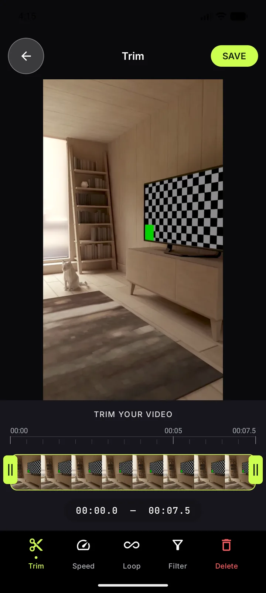
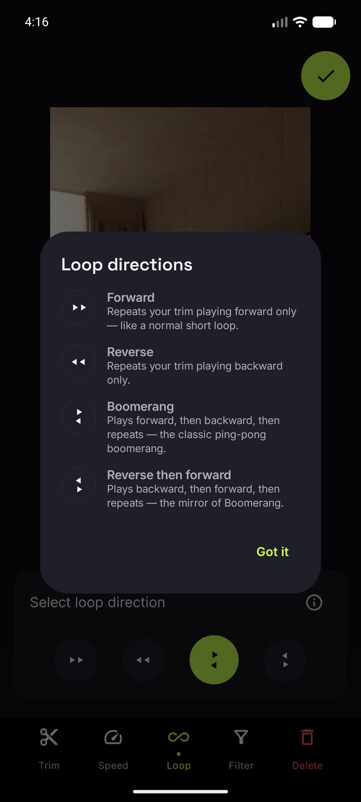

# E2E proof — localization readiness (every UI string now a resource)

**Date:** 2026-08-16 · **Device:** `Pixel_8` AVD (API 36, `emulator-5556`, cold boot, `-memory 4096`)
**Build:** debug, `feature/localization-readiness` @ `a86ea59` · **App version:** 1.0.42 (versionCode 42)

The change moves ~55 user-facing strings out of Kotlin literals and into `strings.xml` so Play
Console's Gemini app-strings translation can see them (see
[`docs/guides/localization.md`](../guides/localization.md)). The risk it carries is not logic — it is
that a string silently fails to resolve, or resolves to the wrong id. So the proof is: drive the real
UI and read back what the accessibility tree actually contains.

## Method

`uiautomator dump` after each step, reading `text=` / `content-desc=` off the live tree — that is the
resolved resource value, not the source literal. Screenshots are the visual companion.

```
launch → onboarding → LET'S GO → camera permission → camera → record 7.5 s → Trim → Loop tab → ⓘ help
```

## What the tree reported

**Onboarding** — 4 strings, including the `100%` that had to survive resource compilation and the
escaped apostrophe in `LET\'S GO!`:


**Camera** — the `contentDescription`s, which are what TalkBack speaks and the instrumented tests
match on:

```
content-desc="Flip Camera"   content-desc="Gallery"
content-desc="Lenses"        content-desc="Start recording"
text="Camera"                text="Video"
```

**Trim** — 10 strings at once, including the whole editor toolbar:

```
content-desc="Trim"  "Speed"  "Loop"  "Filter"  "Delete"  "Discard clip"  "Trim start"  "Trim end"
text="Trim"  "SAVE"  "TRIM YOUR VIDEO"  "Speed"  "Loop"  "Filter"  "Delete"
```



**Loop-direction help dialog** — the densest case, and the one that changed shape: `LoopModeChip` is
now a table of `@param:StringRes Int` rather than `String`. All 12 entries plus the shared
`dialog_got_it` resolve:



## Logcat

No `Resources$NotFoundException`, no `FATAL EXCEPTION`, empty crash buffer across the whole run.

## Gates

| Gate | Result |
|---|---|
| `:app:compileDebugKotlin` | `BUILD SUCCESSFUL`, exit 0, **0 warnings** (`@param:StringRes` matches `Lens.kt`; the bare `@StringRes` form emits KT-73255) |
| `:app:assembleRelease` | `BUILD SUCCESSFUL`, exit 0 |
| `:app:testDebugUnitTest` | **436 tests, 0 failures, 0 errors, 0 skipped** |
| `:app:connectedDebugAndroidTest` | **103 tests, 0 failures** (1 skipped, pre-existing) |
| `:app:lintDebug` | **0 errors**, 25 warnings — all pre-existing (`GradleDependency` ×19, `AndroidGradlePluginVersion` ×2, `OldTargetApi`, `UseKtx`, `VectorRaster`, `LintBaseline`). None in a file this PR touches |

One lint error *was* introduced and fixed before commit: the zoom chip's first draft used
`LocalContext.current.getString(...)`, which trips `LocalContextGetResourceValueCall`. It now uses
`LocalResources.current`, matching the existing `MainActivity` precedent.

## Not verified

- **Engine 2 "Inspect Code"** — not run (see `docs/STATIC_ANALYSIS.md`); substituted by lint +
  a zero-warning compile.
- **Actual translated output.** No `values-<lang>/` exists yet and none is added by this PR — Play
  generates and injects those at bundle-processing time, after the owner enables the service. What
  is proven here is that the *input* (`strings.xml`) is now complete.
- **RTL layout.** Unchanged by this PR, but it becomes load-bearing the moment an RTL locale is
  selected in Play Console. Run [`docs/guides/samsung-rtl-steps.md`](../guides/samsung-rtl-steps.md)
  before enabling Arabic/Hebrew/Persian/Urdu.
- **Physical hardware.** Emulator only; this change touches no camera or codec path.

## Manual QA checklist for the reviewer

- [ ] Onboarding headline, both trust badges, and the CTA read exactly as before.
- [ ] Camera: TalkBack announces "Lenses" / "Flip Camera" / "Gallery" / "Start recording", and
      "Stop recording" once recording; in photo mode the shutter announces "Take photo".
- [ ] Pinch to zoom — the chip announces "Zoom level, 2.3x" with the live ratio interpolated
      (this one is `LocalResources.getString(id, arg)`, not `stringResource`).
- [ ] Speed tab: slider announces "Playback speed" and states "1.5 times speed".
- [ ] Trim and editor discard dialogs: the editor's dismiss verb is "Keep editing", Trim's is "Keep".
- [ ] Looks tab under memory pressure still shows the memory-only hint (lesson 026 copy unchanged).
