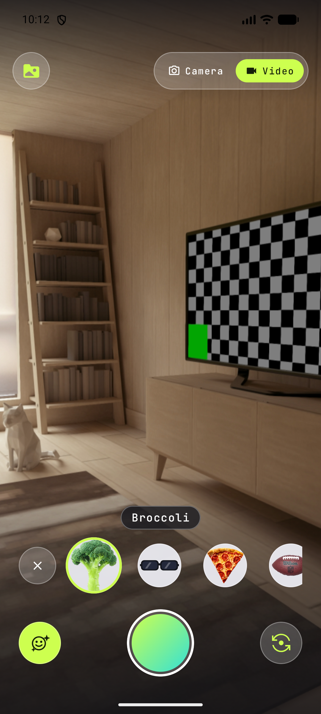

# E2E proof — Big Mouth and Bug Eyes removed

**Date:** 2026-08-17
**Branch:** `feature/remove-lenses`
**Device:** Pixel_8 AVD (API 36), `emulator-5584`
**Build:** `:app:installDebug` from commit `593fb26`

---

## What was verified

| Claim | How | Result |
|---|---|---|
| Big Mouth and Bug Eyes are gone from the carousel | `uiautomator dump` of the open lens tray, both ends of the rail | ✅ Seven entries, neither name present |
| The seven survivors all still render a thumbnail | Same dump, scrolled to each end | ✅ Broccoli · Shades · Pizza Face · Football · Dog · Twisted Tongue · Elvis |
| Selecting a lens still works | Tapped Broccoli, read the name pill | ✅ Pill reads "Broccoli", thumbnail highlighted |
| The collapsed camera shader is a no-op | Live preview after the `applyWarp` removal | ✅ Scene renders upright, correct handedness, no tearing — see screenshot |
| The GL programs still compile and link | `logcat -s OpenLoopLens` | ✅ `Lens output targets=3 size=1280x960 inputDet=-1.0 outputDet=-1.0`, no `GL initialisation failed` |
| No crash on the lens path | `logcat` scan for `FATAL EXCEPTION` / `AndroidRuntime` errors | ✅ None |

The screenshot is the head of the rail. Big Mouth and Bug Eyes used to occupy positions 3 and 4,
between **Shades** and **Pizza Face** — the gap in that screenshot is the whole change.

## Why the preview render is the shader proof

`CAMERA_FRAGMENT_SHADER` lost its flip into y-down screen space along with `applyWarp`. That flip
and its inverse cancel exactly when no warp fires, so the removal is arithmetically a no-op — but
"arithmetically" is the same word Lesson 011's vacuous `zipalign` pass used. A rendered, correctly
oriented, un-mirrored preview is the observation that settles it: a sign error in either direction
would show as an upside-down viewfinder, not as a subtle artifact.

## Gates cleared off-device

| Gate | Result |
|---|---|
| `:app:assembleDebug` | BUILD SUCCESSFUL, exit 0, zero `e:` |
| `:app:assembleRelease` | BUILD SUCCESSFUL, exit 0, zero `e:` |
| `:app:testDebugUnitTest` | 433 tests, 0 failures, 0 errors, 0 skipped |
| `:app:connectedDebugAndroidTest` (Pixel_8 AVD) | 102 tests, 0 failures, 1 skipped — the skip is `VideoReverserTest.reverse_pass1SurvivesOnSamsung_afterPostTransformSettle`, a Samsung-gated case that self-skips on a Pixel and is unrelated to this change |
| `:app:lintDebug` | 0 errors (24 warnings, 11 baselined — unchanged from `main`) |
| Tier 3 (`markdownlint`, `cspell`) on changed `.md` | No new findings; the 21 markdownlint hits are pre-existing lines in `CLAUDE.md` and `store-listing.md` that this PR did not touch |

## Not verified

- **Engine 2 "Inspect Code" — not run.** Not an environment gap this time: `docs/STATIC_ANALYSIS.md`
  §Tier 2 documents that on Studio Quail 2026.1.1 the headless `inspect.bat` run is **vacuous** on
  this project (no Gradle sync → no module model → zero results even with a planted probe). Reporting
  it as "not run" rather than implying a pass, per that document's own instruction.
- **Real hardware.** Everything above is the Pixel_8 AVD. The change is a deletion with no
  device-specific surface — no encoder, no FGS, no OEM path — so the OEM lanes were not re-run.
- **Live Play Store listing.** `docs/play-store/store-listing.md` now says "Broccoli, Shades or
  Elvis"; pushing that copy to the Play Console is a **manual owner follow-up**, not part of this PR.
