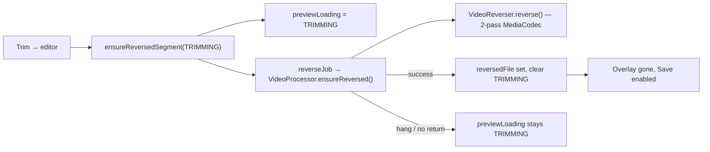

# Library import stuck on "Trimming.." — bug postmortem

This document explains the bug where importing a video from the device library left the boomerang editor on the **"Trimming.."** overlay indefinitely (or until a codec crash), while camera captures worked fine. Fixed in PR [#50](https://github.com/stozo04/OpenLoop/pull/50) (`versionCode` 4 / `versionName` 1.0.3).

Related handoff: [`docs/active/editor-trimming-overlay-stuck/HANDOFF.md`](docs/active/editor-trimming-overlay-stuck/HANDOFF.md).

---

## What users saw

After **importing a video from the gallery** (not a camera capture):

1. Trim → **Save** (or a toolbar tab into the editor)
2. Full-screen overlay: **"Trimming.."**
3. It stayed for a long time or forever
4. **Save** stayed disabled

Camera clips usually cleared in a few seconds. **Only uploaded library videos** behaved badly.

That overlay is not a separate trim operation. It means the app is running **reverse preview generation** — building a reversed MP4 so the default boomerang mode (`FORWARD_THEN_REVERSE`) can loop in the editor.

| `EditorLoadingKind` | Message shown |
|---------------------|---------------|
| `TRIMMING` | **Trimming..** — first entry from trim into the editor |
| `LOOPIFYING` | **Loopifying..** — later reverse kicks (mode change, return from trim) |

---

## How the overlay is wired



The editor shows the overlay when `previewLoading` is `TRIMMING` or `LOOPIFYING` and there is no `reversedFile` yet. Save is disabled while `awaitingReverse` is true (reverse-containing mode, no file, no failure flag).

**Any** of these keeps **Trimming..** on screen:

- Reverse never finishes (slow or hung codec)
- Reverse fails but UI does not clear loading (older bug family)
- Reverse finishes but `previewLoading` is not cleared (stale state)
- Reverse is cancelled and restarted so it never completes

This bug hit **several** of those at different stages of the fix.

---

## Why library uploads differ from camera clips

Camera recordings are predictable for this pipeline: ~30 fps, SDR H.264, modest length, already in the app’s world.

**Gallery imports are adversarial** (see lesson 020): HDR/HEVC, odd metadata, **high reported frame rate**, variable frame spacing, sync samples before the trim window, etc.

On a **Pixel 10 Pro Fold** repro (portrait ~368×832 H.264):

- Pass 1 was still grinding at **~994 frames** in an ~11 s log window
- Another capture completed with **`reverse pass2: … frames=948`** in ~21 s
- Encoder often resolved to **`c2.google.avc.encoder`** (slow software path on some devices)

For that file, pass 1 was doing **hundreds of frames**, each re-encoded as an **I-frame** (required so pass 2 can seek frame-by-frame backwards). That is minutes of work on a slow encoder — easy to read as “infinite Trimming..” even when work was still progressing.

---

## Layer 1 — Pass 1 could wedge on imports (seek / zero frames)

Pass 1 seeks with `SEEK_TO_PREVIOUS_SYNC`, which can land on a keyframe **before** trim start. Older logic treated samples before the trim window as end-of-stream:

- **Zero frames** fed to the decoder
- Muxer never started
- The decode loop waited forever when container `durationUs > 0`

**Fix:** After seek, advance samples until `sampleUs >= trimStart`. End input when `sampleUs > endUs`. If input ends with no muxer track, exit the loop (zero-frame pass).

That helped some imports. Logs showing **active encoding** (many frames) meant this alone did not explain every library failure.

---

## Layer 2 — Perceived infinite loop (very slow pass 1)

Pass 1 re-encodes the trim window so **every fed sample becomes a keyframe** — required for the two-pass reverse algorithm (`VideoReverser`, see `docs/active/boomerang-rollout/RESEARCH-reverse-video.md`).

Library clips often have **~2× the sample density** of camera video (e.g. ~60 fps effective → ~948 samples in ~15 s).

| Observation | Meaning |
|---------------|---------|
| Overlay shows **Trimming..** | Correct while reverse runs |
| No exception, no `reverse_failed` | Not a caught failure — looks “stuck” |
| Long wall time | User gives up before pass 2 |

**Mitigation:** Cap pass-1 **encode rate at 30 fps** by skipping dense extractor samples (advance only, do not decode every frame). Cuts preview reverse time for phone exports. **Export still uses the full-rate source** at render time.

---

## Layer 3 — ViewModel / UI could keep Trimming.. wrong

Even when reverse was slow or flaky, the UI could misbehave:

| Issue | Effect |
|--------|--------|
| `ensureReversedSegment` **cancelled and restarted** reverse on every call | Progress discarded; overlay never “finishes” |
| `previewLoading` set but **job not active** | TRIMMING forever with no work running |
| **`updateFilter`** during reverse replaced TRIMMING with FILTERING, then cleared overlay | Confusing state; save could stay disabled via `awaitingReverse` |
| No **timeout** | True hangs never became retry UI |

**Fixes:**

- Do not restart an active `reverseJob`
- Recover stale `previewLoading` when no job is running
- Keep TRIMMING visible during filter changes while reverse runs
- **120 s timeout** → `reverseFailed` + Try again
- Hide TRIMMING/LOOPIFYING in the overlay when `reversedFile` already exists (stale-state guard)

Key files: `OpenLoopViewModel.kt`, `BoomerangEditorScreen.kt`.

---

## Layer 4 — MediaCodec crash after first skip fix (real buffer bug)

After frame-skipping was added, some devices surfaced **“Could not loop!!”** — progress, because failure was visible:

```text
MediaCodec$CodecException: Fatal error: failed to fetch buffer for index 3
  at VideoReverser.runDecodeEncodeLoop → queueInputBuffer
MPEG4Writer: Stop() called but track is not started or stopped
```

**Cause:** Violation of MediaCodec input-buffer contract:

1. `dequeueInputBuffer()` — you **own** that input slot
2. You must **`queueInputBuffer()`** exactly once on that slot (payload or EOS), or the codec wedges

**Buggy flow:**

```text
dequeue buffer #3
→ decide SKIP (dense frame)
→ extractor.advance() only
→ never queue buffer #3
→ loop again, dequeue another buffer
→ later queueInputBuffer on #3 → fatal error
```

**Second bug:** After encoding a frame, if `advance()` failed, code queued **EOS on the same buffer index** already used for that frame.

**Correct pattern (shipped):**

1. **Skip only by advancing the extractor** — do not dequeue decoder input for skipped samples
2. **One dequeue → one queue** (one frame or EOS)
3. When the extractor is exhausted, set `pendingDecoderEos`; on the **next** loop iteration dequeue a **fresh** buffer and queue EOS

---

## Timeline of symptoms

| Stage | Behavior |
|--------|----------|
| Original | **Trimming..** forever — slow pass 1 and/or zero-frame wedge; no retry |
| After seek + ViewModel fixes | Still bad on dense library files — ~900+ frames, slow encoder |
| After 30 fps skip (buggy buffers) | **CodecException** — “Could not loop” (failure surfaced) |
| After buffer lifecycle fix | **Works** — overlay clears, preview loops |

---

## One-sentence summary

**Trimming..** meant preview reverse was running; for uploaded library videos that implied a **very heavy pass-1 transcode** on **dense, phone-export-style** media, and the app either **never finished in time**, **never cleared UI state**, or **crashed MediaCodec** because skipped frames still **claimed decoder input buffers** without queueing them back.

---

## What shipped in the fix

Included in PR #50 / release **1.0.3** (`versionCode` 4):

- Pass-1 seek / zero-frame exit
- 30 fps subsampling with correct buffer lifecycle (`pendingDecoderEos`)
- Encoder preference ranking (deprioritize slow `google` software AVC where possible)
- ViewModel: no restart while job active, timeout → retry, overlay guards
- Unit tests: `Pass1SampleActionTest`, `OpenLoopViewModelTest` regressions

**On-device validation is mandatory** — unit tests use a fake `VideoProcessor` and do not run real MediaCodec.

---

## Reproduction checklist (regression QA)

1. Fresh install or clear app data
2. Gallery → import the same library video that failed before
3. Trim → **Save** (or Speed on trim toolbar)
4. Note **Trimming..** vs **Loopifying..**
5. Switch Speed / Loop / Filter **without** moving trim handles
6. Wait at least 30 s once (distinguish slow vs hung)
7. Logcat filter: `package:io.github.stozo04.openloop`, tags `VideoReverser`, `OpenLoopViewModel`

**Healthy:** Overlay clears, preview loops, Save enables.  
**Failure:** `reverse_failed` + Try again, not infinite **Trimming..**

---

## Related docs

- [`docs/active/editor-trimming-overlay-stuck/HANDOFF.md`](docs/active/editor-trimming-overlay-stuck/HANDOFF.md) — engineering handoff
- [`docs/lessons_learned/020-imported-clips-hdr-codec-and-reverse-failure-recovery.md`](docs/lessons_learned/020-imported-clips-hdr-codec-and-reverse-failure-recovery.md) — HDR / encoder / failure UI
- [`docs/play-store/release-signing-and-aab.md`](docs/play-store/release-signing-and-aab.md) — building the Play bundle
- [`docs/active/boomerang-rollout/RESEARCH-reverse-video.md`](docs/active/boomerang-rollout/RESEARCH-reverse-video.md) — why two-pass reverse exists
