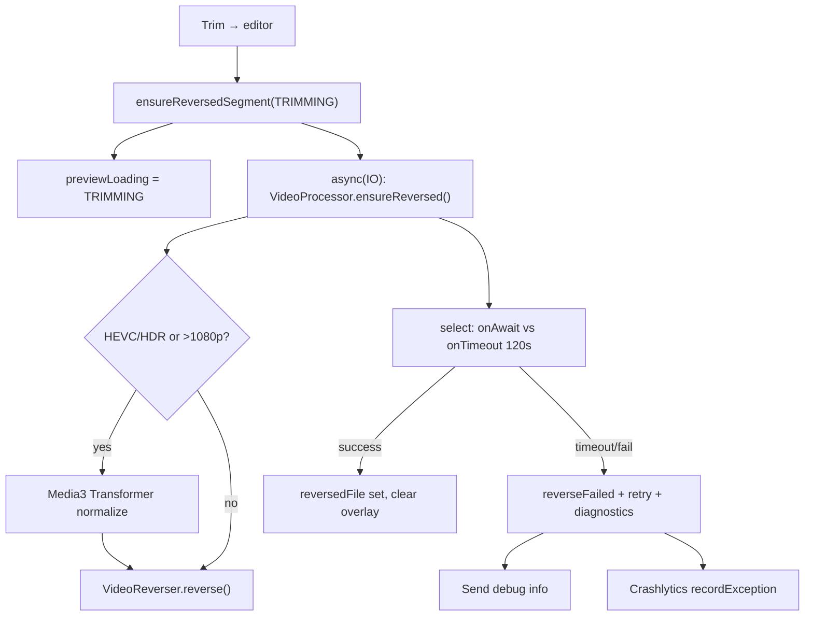

# “Trimming..” stuck / preview reverse failures — postmortem

Users saw a full-screen **“Trimming..”** overlay after leaving the Trim screen (or tapping Speed/Loop/Filter into the editor). **Save stayed disabled.** On some devices (notably **Samsung S24+** in Brazil) the overlay never cleared and **never showed “Couldn’t loop that clip”** — even after waiting many minutes.

**That overlay is not a separate trim step.** It means the app is building a **reversed MP4** for the default boomerang mode (`FORWARD_THEN_REVERSE`) via a two-pass `MediaCodec` pipeline in `VideoReverser`.

| `EditorLoadingKind` | UI copy |
|---------------------|---------|
| `TRIMMING` | **Trimming..** — first entry from Trim into the editor |
| `LOOPIFYING` | **Loopifying..** — later reverse kicks (mode change, return from Trim) |

---

## Fix timeline (releases & PRs)

| Release / PR | What it addressed |
|--------------|-------------------|
| [#50](https://github.com/stozo04/OpenLoop/pull/50) — **1.0.3** (`versionCode` 4) | Library import seek wedge, 30 fps pass-1 cap, MediaCodec buffer lifecycle, encoder ranking, ViewModel stale loading, **120 s `withTimeoutOrNull`** (often **did not unblock UI** on wedged codecs) |
| [#51](https://github.com/stozo04/OpenLoop/pull/51) — **1.0.5** (`versionCode` 5) | **Hard UI deadline** (`select` + `onTimeout`), HEVC/HDR pre-normalize, Media3 **decoder fallback**, vendor encoder preference, **Send debug info**, Crashlytics `recordException` |

---

## Root cause (why “Trimming..” never ended)

Several independent failures stacked; Samsung **camera + gallery** hits more than one.

### 1. Heavy preview reverse (expected slowness)

Pass 1 re-encodes the trim window so **every kept frame is a keyframe** (required for frame-by-frame reverse in pass 2). Library and phone-export clips are **adversarial**: HEVC, HDR, dense 60 fps samples, odd sync points ([lesson 020](docs/lessons_learned/020-imported-clips-hdr-codec-and-reverse-failure-recovery.md)).

Symptom: **Trimming..** for 30–120+ seconds on a slow software encoder (`c2.google.avc.encoder`).

### 2. `withTimeoutOrNull` did not unblock the UI (critical)

Kotlin/Android guidance ([`withTimeout` docs](https://kotlinlang.org/api/kotlinx.coroutines/kotlinx-coroutines-core/kotlinx.coroutines/with-timeout.html), [coroutines best practices](https://developer.android.com/kotlin/coroutines/coroutines-best-practices)): **cancellation is cooperative**. If `MediaCodec` blocks in native code, the timeout coroutine **may never return**, so:

- `reverseFailed` is never set
- **“Couldn’t loop that clip”** never appears
- **Trimming..** stays forever

This matches reports: testers waited **much longer than 2 minutes** with no failure screen.

**Fix (PR #51):** Race preview reverse with `select` + `onTimeout`, return immediately on deadline, **`recordException`-ready failure path**, do **not** wait for the wedged worker to finish cancelling.

### 3. Samsung / OEM codecs

- CameraX `Quality.HD` does not force H.264; Samsung often records **HEVC and/or HDR** at ≤1080p — previously **skipped** the >1080p pre-scale path and went straight into raw `VideoReverser`.
- Media3 `Transformer` defaults **disable decoder fallback**; HW decoder init can fail on HEVC/high profile ([androidx/media#2189](https://github.com/androidx/media/issues/2189), [#2751](https://github.com/androidx/media/issues/2751)).

**Fix (PR #51):** Pre-normalize HEVC/HDR via Transformer before reverse; `DefaultDecoderFactory.setEnableDecoderFallback(true)` on Transformer; prefer Exynos/SEC/QTI encoders over Google software AVC.

### 4. Older bug families (PR #50)

| Issue | Effect |
|--------|--------|
| Pass-1 seek before trim start → zero frames | Immediate EOS / hung loop |
| Frame skip without queueing decoder buffers | `CodecException` — “Could not loop” |
| `ensureReversedSegment` restarted active job | Progress discarded |
| Stale `previewLoading` with no job | TRIMMING forever |

---

## Architecture (how the overlay is wired)

Save is disabled while `awaitingReverse` (reverse mode, no `reversedFile`, no failure yet).

Key files:

- `OpenLoopViewModel.kt` — `ensureReversedSegment`, timeout, failure state
- `VideoProcessor.kt` — `prepareReverseInput`, Transformer decoder fallback
- `VideoReverser.kt` — two-pass reverse, encoder selection, logging
- `BoomerangEditorScreen.kt` — overlay, retry, Send debug info
- `diagnostics/ReverseCrashlytics.kt` — non-fatal reporting

---

## Diagnostics (testers without Android Studio)

| Path | When | What you get |
|------|------|----------------|
| **Send debug info** (in-app) | After **Couldn’t loop that clip** | Immediate plain-text (device, version, mime, trim) |
| **Firebase Crashlytics** | Same failure; tester reopens app | Non-fatal in console with custom keys — [setup & viewing](docs/diagnostics/firebase-crashlytics-trimming.md) |
| **Take bug report** (Developer options) | Stuck on old build / no Firebase | Full system zip; heavy for users |
| **adb logcat / bugreport** | You or a technical helper | Best codec detail; needs platform-tools |

Do **not** rely on Play Store “Logcat Reader” apps for average testers — most need a PC `adb` setup first.

---

## Regression QA

1. Install build **≥ 1.0.5** with `google-services.json` if testing Crashlytics.
2. **Camera** and **gallery import** on a Samsung (or HEVC/HDR sample).
3. Trim → enter editor → note **Trimming..**.
4. **Healthy:** Overlay clears; preview loops; Save enables (may take up to ~2 min on slow devices).
5. **Failure:** Within **~120 s**, **Couldn’t loop that clip** + **Try again** + **Send debug info** — not infinite Trimming.
6. After failure: tester force-stops app, reopens → verify non-fatal in Firebase (if configured).
7. Logcat (optional): `VideoReverser`, `OpenLoopViewModel`, tags `reverse start`, `reverse pass1`, `reverse pass2`.

Unit tests (no real MediaCodec):  
`./gradlew :app:testDebugUnitTest --tests "io.github.stozo04.openloop.ui.OpenLoopViewModelTest.reverse*"`

---

## One-sentence summary

**Trimming..** meant preview reverse was running; Samsung and library clips often use **HEVC/HDR** and **slow or wedged MediaCodec** work, and **`withTimeoutOrNull` could wait forever on native code**, so the UI never reached the failure screen — fixed by a **non-blocking timeout**, **normalize + decoder fallback**, and **Crashlytics / Send debug info** for remote triage.

---

## Related docs

- [**Engineering handoff (full)**](docs/active/editor-trimming-overlay-stuck/ENGINEERING-HANDOFF.md) — start here for next engineer / agent
- [Firebase Crashlytics & tester instructions](docs/diagnostics/firebase-crashlytics-trimming.md)
- [Earlier investigation notes](docs/active/editor-trimming-overlay-stuck/HANDOFF.md)
- [Lesson 020 — HDR / imports](docs/lessons_learned/020-imported-clips-hdr-codec-and-reverse-failure-recovery.md)
- [Lesson 021 — no downscale inside VideoReverser](docs/lessons_learned/021-reverse-downscale-surface-mismatch.md)
- [Reverse video research](docs/active/boomerang-rollout/RESEARCH-reverse-video.md)
